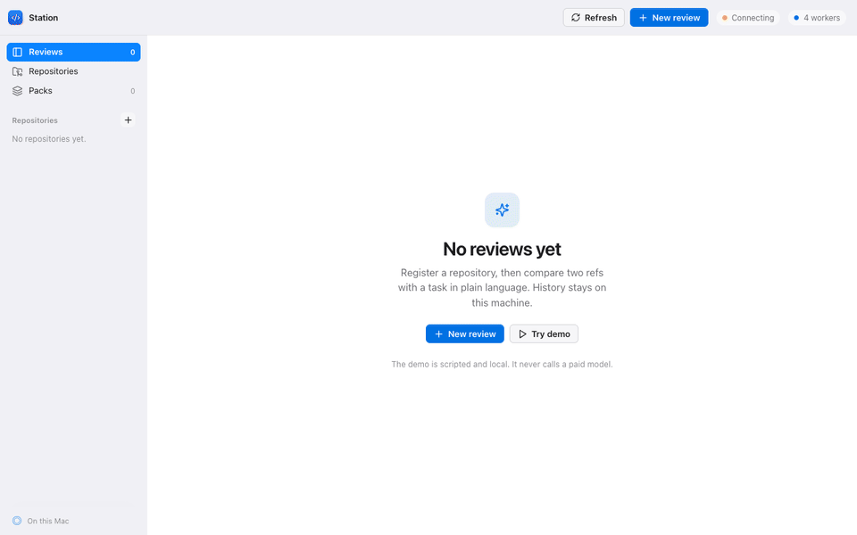
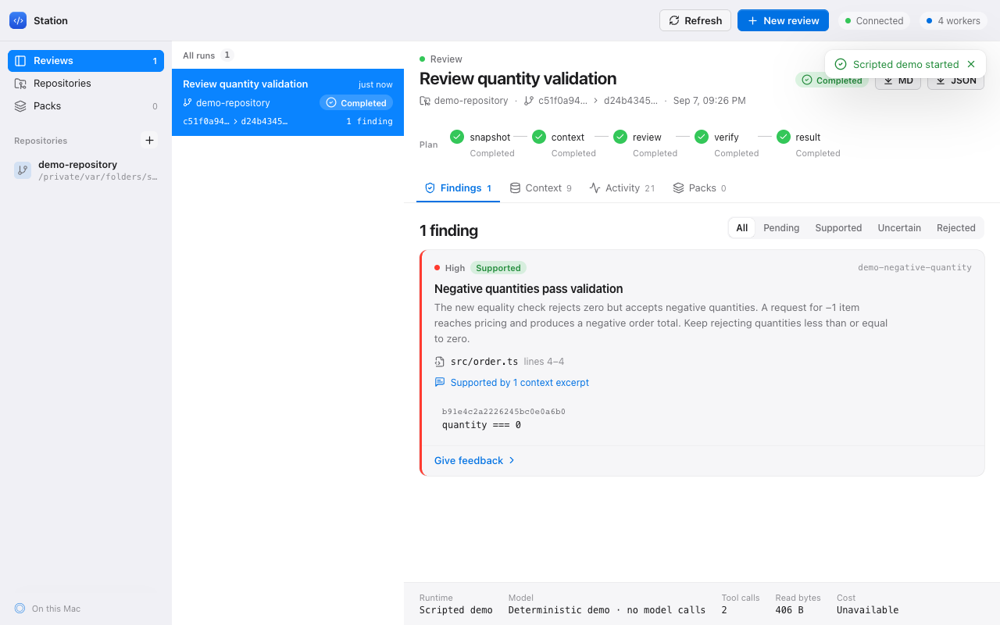
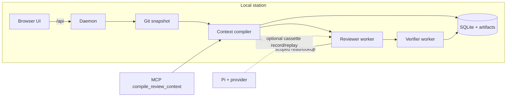

# Agent Control Station

A finding is rejected if its evidence quote does not verify against the file it cites. Every worker runs under hard budgets (tool-call ceiling, deadline, context size), with read-only scoped tools and a local audit trail.

CodeRabbit, Greptile, and Cursor BugBot also review pull requests. This station differs by pinning a Git diff, compiling the excerpts a worker may read, and rejecting any finding whose quote is not an exact substring of the cited file.

This pilot supports TypeScript/JavaScript repositories, four concurrent review workers, local feedback and Markdown/JSON exports. Pi runs make requests to the selected model provider. The explicitly labelled demo is deterministic and makes no model calls.

[What a review looks like.](examples/review-demo.md)

## Run locally

Requirements: Node.js 24 or newer, Git, and pnpm (the repository pins pnpm 12.3.4).

```sh
pnpm install
pnpm build
pnpm start
```

Open [127.0.0.1:4317](http://127.0.0.1:4317). Choose **Try demo** for a complete, no-cost example. It creates a small local Git repository, reviews a seeded quantity-validation change, and produces a clearly labelled scripted finding.



The same walkthrough is saved as [docs/demo/local-run.webm](docs/demo/local-run.webm) (local **Try demo** from start to a supported finding with evidence). The scripted demo finishes in seconds; this is not a padded two-minute idle recording. Re-record after UI changes with `pnpm demo:record` (needs local Chrome and `ffmpeg`).



## Architecture



A run is snapshot → compiled context → review → verify. Workers cannot shell or write. Invalid evidence quotes reject **that finding**; they do not fail the run. Chat JSON is accepted only as a fallback if `submit_review` was not used.

For a real review, provide a model-provider API key in the daemon's environment, restart it, register an existing local repository, and select **Pi** plus an available model. Supported environment variables include `ANTHROPIC_API_KEY`, `OPENAI_API_KEY`, `GEMINI_API_KEY`, `OPENROUTER_API_KEY`, `MISTRAL_API_KEY`, `GROQ_API_KEY`, and `XAI_API_KEY`. Keep credentials out of source files and browser forms. The application does not load a project `.env` file or automatically reuse a Claude Code/Codex subscription.

Select base/head Git refs, describe the review task, and queue the run. Optional GitHub PR import uses the installed and signed-in `gh` CLI to read metadata and fetch local objects; it does not publish reviews. GitHub.com is supported by the pilot importer.

Data lives in `.station/`, which is ignored by Git. Override with `STATION_DATA` or `pnpm cli serve --data /absolute/path --port 4317`. History and source excerpts are stored locally; source context for Pi runs is sent to the selected provider. Local access assumes a single trusted operator.

## What a run does

1. Pin the repository's Git revisions and compute their merge-base diff.
2. Compile immutable source excerpts and a manifest explaining why each excerpt was selected.
3. Run a specialized reviewer with only scoped read/lookup tools.
4. Run a fresh finding verifier against the original findings and captured evidence.
5. Save all dispositions, usage, read traces, operator feedback and exportable results.

Each worker has a ten-minute deadline and a forty-tool-call ceiling. The upfront context default is 96 KiB, including at most 8 KiB of matching judgment packs. Token counts for context size and exploration are estimates; provider-reported usage is recorded separately. Unknown cost is displayed as unavailable.

Cancellation releases a worker slot. An interrupted daemon marks unfinished attempts as interrupted. Retry creates a new attempt using the original Git snapshot and captured pack versions, even if branches or active packs have since changed. To change scope or budget, create a new review.

Model output is not deterministic. Context selection is: the same Git inputs, task, compiler/policy version and packs produce the same packet identity. Dynamic runtime behavior and external dependency internals cannot be fully established through static analysis; coverage limitations remain visible in the run.

## Inspect context without a model

```sh
pnpm cli context --repo /absolute/repository --base main --head feature-branch --out /tmp/review-context
```

This writes `context.json` and `context.md` into the explicit output directory. Exit code 2 means the required context does not fit or no reviewable scope was selected. Output includes excerpt IDs, source positions, provenance, omissions and the compiler version. No model credentials are needed.

Cursor and Claude Code can request the same packet over MCP:

```json
{
  "mcpServers": {
    "agent-control-station": {
      "command": "pnpm",
      "args": ["cli", "mcp"],
      "cwd": "/absolute/path/to/agent-control-station"
    }
  }
}
```

`compile_review_context` takes `repo`, `base`, optional `head` / `task` / `scopePaths`, and returns excerpt ids, limitations, and the reviewer prompt. It does not call a model.

## Provider cassettes

Pi HTTP is recorded when `STATION_CASSETTE=record` and `STATION_CASSETTE_FILE` point at a JSON file. Replay with `STATION_CASSETTE=replay`: unmatched URLs throw and no live provider call is made. Secrets in headers and query strings are redacted. See `test/cassettes/README.md`.

## Judgment packs

Create packs in the **Judgment packs** view. Matching is based on path globs and reviewer/verifier roles. Packs hold local evaluation criteria and historical examples; current code facts always come from the Git snapshot.

Feedback with an explanatory note can create an inactive draft. Review its wording and scope before activating a new version. Pack versions are immutable and a run captures the versions it was started with. Automatic learning and automatic promotion are intentionally outside this pilot.

Saved packs also have Markdown representations in `.station/packs/`. The JSON frontmatter is the editable structured source; the body is a rendered view. To import an edited pack, increment `version` and run:

```sh
pnpm cli pack-import --file /absolute/path/pack.md
```

## Evaluate quality and exploration

Copy `examples/benchmark.dataset.json` or generate the seeded corpus (`pnpm cli corpus --out DIR`, described in `corpus/README.md`). Supply real repository paths, immutable refs, task descriptions and independently identified expected defects. Keep pack-training PRs separate from evaluation PRs. Start with at least twenty held-out PRs and three repeats for each variant when measuring a model.

```sh
pnpm cli corpus --out /tmp/station-corpus
pnpm cli benchmark --dataset /tmp/station-corpus/dataset.json --runtime fixture --repeats 1 --execute --out /tmp/station-bench
```

`--runtime fixture` recovers `STATION-DEFECT` markers and auto-assesses `path`+`quote` labels. It makes no model calls. Add `--runtime pi --provider PROVIDER --model MODEL --execute` for a paid experiment. Benchmark output directories must be fresh so previous results are not overwritten.

The three variants share worker roles, model settings and call limits: diff plus full allowed snapshot access; compiled context; compiled context plus judgment packs. The baseline uses the same harness read protocol, with all eligible snapshot files available, rather than a stock Pi CLI session.

After a Pi run, review the blinded `*.assessment.json` files. Set each finding's verdict to `accepted` with a valid `matchedLabelId`, or `rejected`. Leave unknowns as `unassessed`. Then run:

```sh
pnpm cli benchmark-score --out /tmp/station-benchmark
```

`report.json` includes precision/recall, failures, unassessed findings, exploration-byte/token estimates, total model tokens, compilation time and total time, plus `report.svg`. Raw traces and all verifier dispositions remain available.

The committed [docs/benchmark/report.json](docs/benchmark/report.json) and [graph](docs/benchmark/report.svg) were produced by the **fixture reviewer on the three seeded cases** (one repeat each). In that harness run, context/packs median exploration was 290 bytes against a 450-byte baseline, with precision and recall both 1.0 because every seeded quote was recovered. That is not a model-quality result and not a claim about unseen repositories. The pilot target for a later paid study remains a 25% reduction in median exploration with no measured precision/recall regression. No effectiveness claim is made before independent assessments and a sufficiently representative dataset exist.

## Development and verification

```sh
pnpm format:check
pnpm typecheck
pnpm test
pnpm build
```

`pnpm check` runs those four commands together. Pull requests and pushes to `main` run the same gates on GitHub Actions, then `pnpm audit --audit-level=high`. This station is local-only; CI does not deploy.

`pnpm dev` watches the daemon. For UI development, additionally run `pnpm --filter @agent-station/web dev`; Vite proxies `/api` to port 4317.

Tests use temporary Git repositories and the scripted runner to verify deterministic snapshots, context selection, scope enforcement, evidence grounding, queue limits, cancellation, recovery, feedback, export and persistence. The Pi subprocess failure path is tested without paid model calls. A successful provider-backed review and the historical benchmark require the operator's provider credentials and dataset.

The module interfaces are documented in `docs/contract.md`. Backend source is under `src/`, the browser app under `apps/web/` (one module per view), and tests under `test/`.

## Pilot limits

- Single operator and loopback-only daemon; no multi-user auth or hosted deployment.
- Reviews and exports are local; coding changes and GitHub publication are not implemented.
- Pi is the real runtime adapter; Claude Code is a future adapter.
- Reviewers have no shell or write tools. Worker process separation is lifecycle isolation, not an OS security sandbox.
- Only captured, allowed Git content participates in a run. Uncommitted changes are excluded.
- Static dependency selection follows direct calls and repository path aliases. External package internals, dynamic dispatch, and most tsconfig compiler options are not modeled. Explicit scope paths also exclude dependencies and tests outside those paths.
- Snapshot compilation currently reads eligible Git blobs individually; very large monorepositories need batching and performance validation before rollout.
- Schema version 1 is created transactionally. Future database upgrades must add a backup step before migration; newer unknown schemas are refused.
